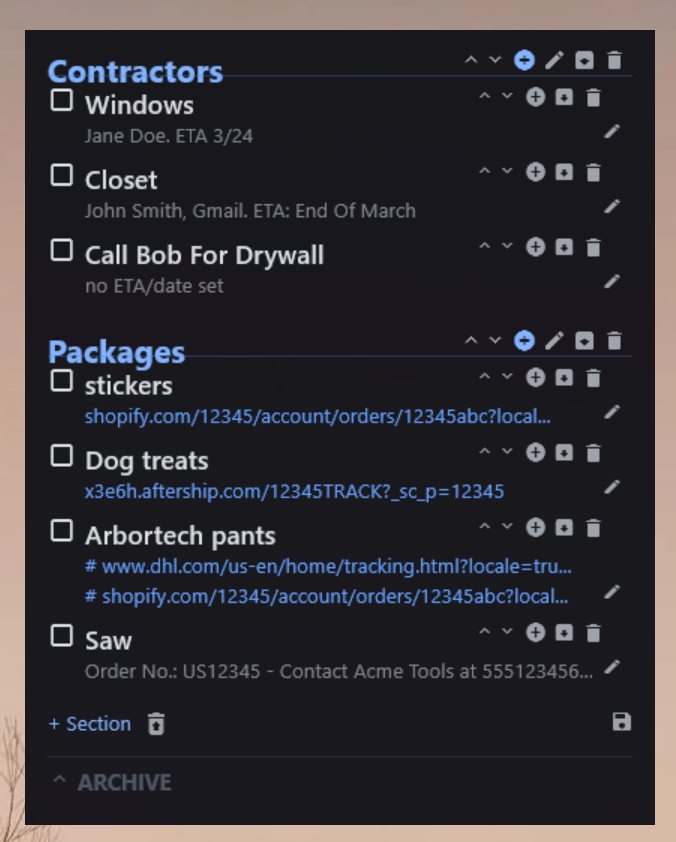

# TodoWidget - Rainmeter Todo Skin

A desktop todo list widget for [Rainmeter](https://www.rainmeter.net/) with sections, tasks, subitems, and clickable URL descriptions.



## Features

- **Sections** with editable labels (e.g., "Now", "Next Week", "Packages")
- **Tasks** with checkboxes, strikethrough on completion
- **Subitems** nested under tasks
- **Descriptions** on tasks and subitems — plain text or clickable URLs
- **Multi-URL descriptions** using `;;` separator (rendered as a bullet list)
- **Inline editing** — double-click section headers, click "add note..." placeholders, or use the pencil icon
- **Archive** — archive sections or tasks into a collapsible archive area
- **Reorder** — up/down arrows to rearrange sections and tasks
- **Backup** — one-click backup of your data file with timestamp
- **Undo delete** — trashed items can be restored
- **Dark theme** with translucent background

## Installation

1. Install [Rainmeter](https://www.rainmeter.net/)
2. Clone this repo into your Rainmeter Skins folder:
   ```
   C:\Users\<you>\Documents\Rainmeter\Skins\TodoWidget
   ```
3. Install the Material Icons font:
   - Copy `@Resources/Fonts/MaterialIcons-Regular.ttf` to `%LOCALAPPDATA%\Microsoft\Windows\Fonts\`
4. Load the skin via Rainmeter: **Manage > TodoWidget > todo > todo.ini**

## Data Format

All data lives in `todo/data.txt`:

```
##Section Label
task name|checked|description
>subitem name|checked|description
```

- `##` prefix = section header
- `>` prefix = subitem (nested under preceding task)
- `checked` field: empty or `x`
- Descriptions can be plain text, a URL (auto-detected), or multiple items separated by `;;`

## Architecture

- `todo/todo.ini` — Skin config with InputText commands
- `@Resources/TodoEngine.lua` — Core engine: parses data, generates meters, handles actions
- `@Resources/DynamicMeters.inc` — Auto-generated by Lua (do not edit manually)
- `@Resources/Icons.inc` — Material Icons unicode mappings
